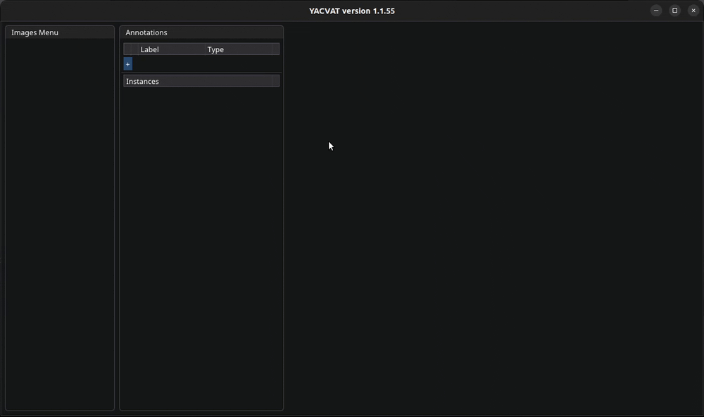

# YACVAT

YACVAT stands for Yet Another Computer Vision Annotation Tool.



## Things I wanted to try during this project

- Making a DearImGui app so I can compare the ease of use with DearPyGui
- Practicing some Cpp as I'm not that familiar with it
- Creating an annotation tool for computer vision
- Learning how to use various libraries in a project
- Using CMake (handling dependencies)
- Basic manipulation of images with OpenGL backend

## HOW TO

### ... compile yourself

- You will need `linsdl2-dev` and cpp compiler like `g++`;
- Run the `get_git_deps.sh` script to clone external repositories required;
- Run the following commands :

```shell
mkdir build
cd build
cmake ..
make
```

### ... create and install `deb` package

```shell
cd build
cpack
dpkg -i Yacvat-x.y.z-Linux.deb
```

## Features in version 1.2

This is the first released version. It can be considered as alpha since it has to be built from source and has not yet been tested by others. It has the following features :

- [x] Define annotation types as areas or points, assign colors and labels
- [x] Import/export annotations using the json file format
- [x] Shortcuts : Use F-keys to quickly navigate and draw annotations
- [x] Edit annotations if needed after they're drawn by selecting them and moving them around
- [x] Annotation instance count displayed by the image names;
- [x] Embed font in application with icons;
- [x] Gather sources as a lib using "proper" cmake design patterns;
- [x] Use github to host release artefacts;
- [x] Package application as deb package;
- [x] Make annotations resizable;
- [x] Better slide when moving an annotation around (not jump to mouse cursor);
- [x] Option to start next image with the same annotation instances than the current one.

## Planned for version 1.3

- [x] Update UI for selecting a folder;
- [ ] Additional resizing handles in the corners of the boxes;
- [ ] Handle boxes overlap (select the one closest to the mouse);
- [ ] JSON export : standard format easy to bootstrap with other tools;
- [ ] JSON files : name options;
- [ ] UI : pop-ups on start-up for tips (open folder, ...);
- [ ] (dev) git submodules for dependencies;
- [ ] Use Boost to handle paths;
- [ ] (Optional) Build also on Windows.

## Libraries used in this project

I used code from other projects hosted on git. Run the `get_git_deps.sh` script to clone them in your current folder to be able to use them. Libraries used are as follows :

- [DearImGUI](https://github.com/ocornut/imgui.git) : switch to branch `master`.
- [Add-on to DearImGUI to be able to handle file dialogs](https://github.com/aiekick/ImGuiFileDialog) : switch to branch `Lib_Only`.
- [Very complete logging library](https://github.com/gabime/spdlog) : switch to branch `v1.x`.
- [Single file library to handle images](https://github.com/nothings/stb) : switch to branch `master`.
- [Json file handler](https://github.com/nlohmann/json.git) : switch to branch `develop`.
- [Finite State Machine](https://github.com/eglimi/cppfsm.git) : switch to branch `main`.
  
## Notes

- GIF generated using `gifski --fps 10 --width 320 -o anim.gif video.mp4`
- Project structured based on [their recommandations](https://cliutils.gitlab.io/modern-cmake/chapters/basics/structure.html)
- Used custom vec2 types instead of ImVec2 for operators : see `vec2.h` and `yacvat_imgui_config.h`
